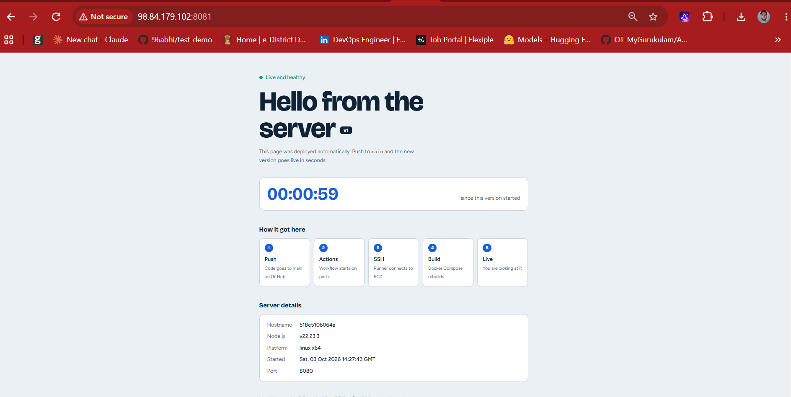

# GitHub Actions Node.js Application

A small Node.js (Express) app that deploys itself to an AWS EC2 instance every time you push to `main`.

**How it works**

```
git push (main)  →  GitHub Actions  →  SSH into EC2  →  git pull  →  docker compose up -d --build
```

## Tech stack

- Node.js 22 and Express
- Docker and Docker Compose
- GitHub Actions (`appleboy/ssh-action`)
- AWS EC2 (Ubuntu)

## Project structure

```
nodejs-app/
├── .github/
│   └── workflows/
│       └── deploy.yml
├── .gitignore
├── Dockerfile
├── docker-compose.yml
├── index.js
└── package.json
```

---

## 1. Create the app (local machine)

Install Node.js, then:

```bash
mkdir nodejs-app && cd nodejs-app
npm init -y
npm i express
```

Open `package.json` and add `"type": "module"` so you can use `import` syntax:

```json
{
  "name": "nodejs-app",
  "version": "1.0.0",
  "type": "module",
  "main": "index.js"
}
```

Create `index.js`:

```js
import express from 'express'

const app = express()
const PORT = process.env.PORT ?? 8080

app.get('/', (req, res) => {
    return res.json({ msg: 'Hello from the server v1 deploy\n' })
})

app.listen(PORT, () => {
    console.log(`Server is up and running on PORT ${PORT}`)
})
```

> **Note:** With `"type": "module"`, use `import`, not `require()`. Using `require()` crashes the container with `ReferenceError: require is not defined in ES module scope`.

Test it:

```bash
node index.js
```

## 2. Dockerize the app

Create `Dockerfile`:

```dockerfile
FROM node:22-alpine

WORKDIR /app

COPY package*.json ./
RUN npm install

COPY . .

EXPOSE 8080

CMD ["node", "index.js"]
```

Build and run it:

```bash
docker build -t node-img:v1 .
docker run -it --rm -p 8080:8080 node-img:v1
```

Create `docker-compose.yml`:

```yaml
services:
  app:
    build:
      context: .
      dockerfile: Dockerfile
    restart: unless-stopped
    ports:
      - "8080:8080"
```

The left number is the port on the server, and the right number is the port inside the container. The container port must match the `PORT` your app listens on (8080).

## 3. Push the code to GitHub

Create an empty repository on GitHub, then on your machine:

```bash
npx gitignore Node
git init
git add .
git commit -m "initial commit"
git remote add origin git@github.com:<your-username>/<your-repo>.git
git push origin master:main
```

## 4. Set up the EC2 instance

1. Launch an Ubuntu EC2 instance.
2. In its **security group**, allow inbound:
   - **22** (SSH)
   - **8080** (the app port from your compose file). Use `http://<public-ip>:8080` to open it.
3. SSH in and install Docker and Docker Compose:

   ```bash
   sudo apt-get update
   sudo apt-get install -y docker.io docker-compose-v2 git
   ```

4. Let the `ubuntu` user run Docker without sudo, then log out and back in:

   ```bash
   sudo usermod -aG docker ubuntu
   ```

5. Clone the repo on the server:

   ```bash
   cd /home/ubuntu
   git clone https://github.com/<your-username>/<your-repo>.git test-demo
   cd test-demo
   docker compose up -d --build
   ```

   The folder name here must match the path used in `deploy.yml`.

## 5. Create an SSH key for GitHub Actions

On your local machine, generate a key used only for deployment (no passphrase):

```bash
ssh-keygen -t ed25519 -f deploy_key -N ""
```

| File | Where it goes |
|---|---|
| `deploy_key.pub` (public) | On EC2, appended to `~/.ssh/authorized_keys` |
| `deploy_key` (private) | In the GitHub secret `SSH_KEY` |

## 6. Add GitHub secrets

In the repo, go to **Settings → Secrets and variables → Actions → New repository secret** and create:

| Secret | Value |
|---|---|
| `SSH_HOST` | The EC2 **public** IPv4 address (not the `172.31.x.x` private one) |
| `SSH_KEY` | The full private key, including the `BEGIN` and `END` lines |

> Attach an **Elastic IP** to the instance. Otherwise the public IP changes after a stop/start and you must update `SSH_HOST`.

## 7. Create the GitHub Actions workflow

Create the file `.github/workflows/deploy.yml`:

```yaml
name: Deploy NodeJS Application to EC2

on:
  push:
    branches:
      - main

jobs:
  deploy:
    runs-on: ubuntu-latest

    steps:
      - name: Deploy Via SSH
        uses: appleboy/ssh-action@v1.0.3
        with:
          host: ${{ secrets.SSH_HOST }}
          username: ubuntu
          key: ${{ secrets.SSH_KEY }}
          script: |
            cd /home/ubuntu/test-demo
            git pull
            docker compose up -d --build
```

There is no checkout step because the server pulls the code itself. Adding `actions/checkout` is harmless but unnecessary and triggers a Node.js deprecation warning.

## 8. Deploy

```bash
git add .
git commit -m "update message"
git push origin main
```

Watch the run under the repo's **Actions** tab. When it turns green, open:

```
http://<EC2_PUBLIC_IP>:8080
```

---

## Troubleshooting

| Problem | Cause and fix |
|---|---|
| Workflow times out connecting | Security group blocks GitHub's IPs on port 22, or `SSH_HOST` is a private IP |
| `Permission denied (publickey)` or `no key found` | `SSH_KEY` must be the full **private** key; its `.pub` goes on EC2 |
| `permission denied ... docker.sock` | Run `sudo usermod -aG docker ubuntu`, then log in again |
| `ReferenceError: require is not defined` | `package.json` has `"type": "module"`; use `import` instead of `require` |
| Browser shows `ERR_CONNECTION_REFUSED` | Container is crashing or the port mapping is wrong. Run `docker compose ps` and `docker compose logs` on EC2 |
| Browser times out | The port isn't open in the EC2 security group |
| Changes don't appear | Confirm the workflow went green and that `git log` on EC2 shows your latest commit |

Useful commands on the server:

```bash
docker compose ps
docker compose logs --tail=30
curl http://localhost:8080
```

##Final output

